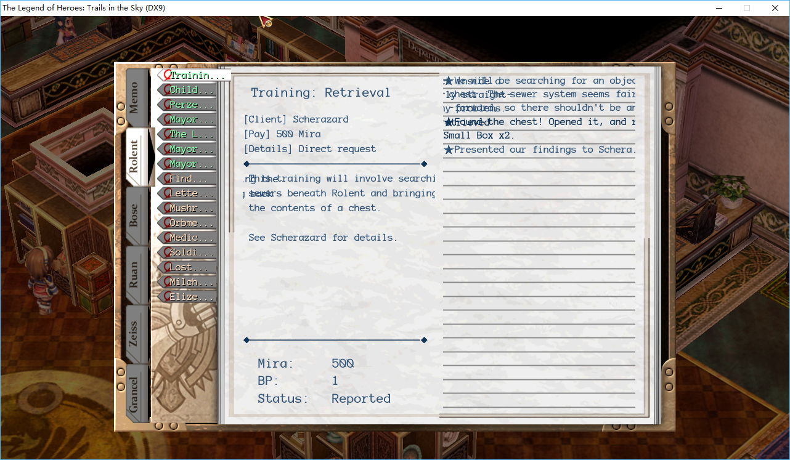

This is an example of Compiling French scripts.

## 0.Preparation

- Clone [EDDecompiler](https://github.com/ZhenjianYang/EDDecompiler), [PyLibs](https://github.com/ZhenjianYang/PyLibs), and [This project](https://github.com/ZhenjianYang/SoraTranslation-Tools) to the same folder.
- Create folder `dir` and copy all **\.dir** files from the game's root folder into it.
- Create folder `fonts_old` and extract all **FONT\*\.DAT** or **FONT\*\.\_DA** files ED6_DT00/ED6_DT20 to it.
- Create folder `py` copy all py scripts files into it.

## 1.make_chlist.bat

This will create **chlist.txt** which contains all characters listed in **half.txt**. Note that we will treat all these characters as half-width characters.

## 2.make_font.bat

This will create fonts files based on **chlist.txt** created at Step 1.   
You may want to replace ttf file `font.ttf` with your own file or change parameters in **2.make_font.bat** to create suitable fonts files.

## 3.compile_scripts.bat

Compile .py scripts in the folder `py`.

## 4.Finish

Import fonts files in folder `fonts` back to ED6_DT00/ED6_DT20 and import scripts files in folder `scena` back to ED6_DT01/ED6_DT21.   
Or if you are using the voice MOD [SoraVoice](https://github.com/ZhenjianYang/SoraVoice), just copy folders `fonts` and `scena` to `voice/` 

## Hints

- **9.dump_fonts_old.bat** and **9.dump_fonts.bat** will dump fonts files to png files. So you can check the fonts without launching your game.
- By default, **2.make_font.bat** will create fonts for all sizes. Adding parameter `-l size` for **MakeFont.py**, this will create font file with the particular size. (But parameters are still based on size 64)  
- Though **chlist.txt** contains ASCII characters, **MakeFont.py** only replace glyphs of Non-ASCII characters. If you also want to replace glyphs of ASCII characters. Modify line 9 to: `set range=%range_all%`   
Widths of ASCII characters are hard-coded in the game's exe. To change them with suitable width, you have to use the voice MOD [SoraVoice](https://github.com/ZhenjianYang/SoraVoice), and leave the file **FONTWDTH._DA** in the folder `fonts`.    
We recommend you not to replace glyphs of ASCII characters, because we believe you won't want to see this in the game:   

